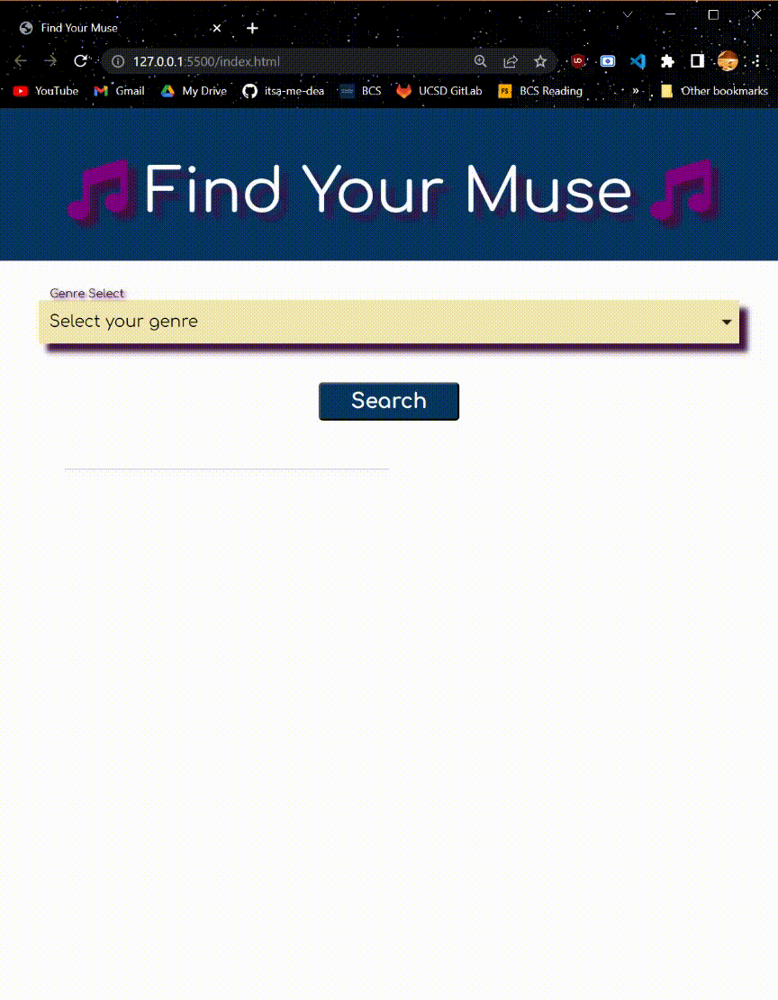
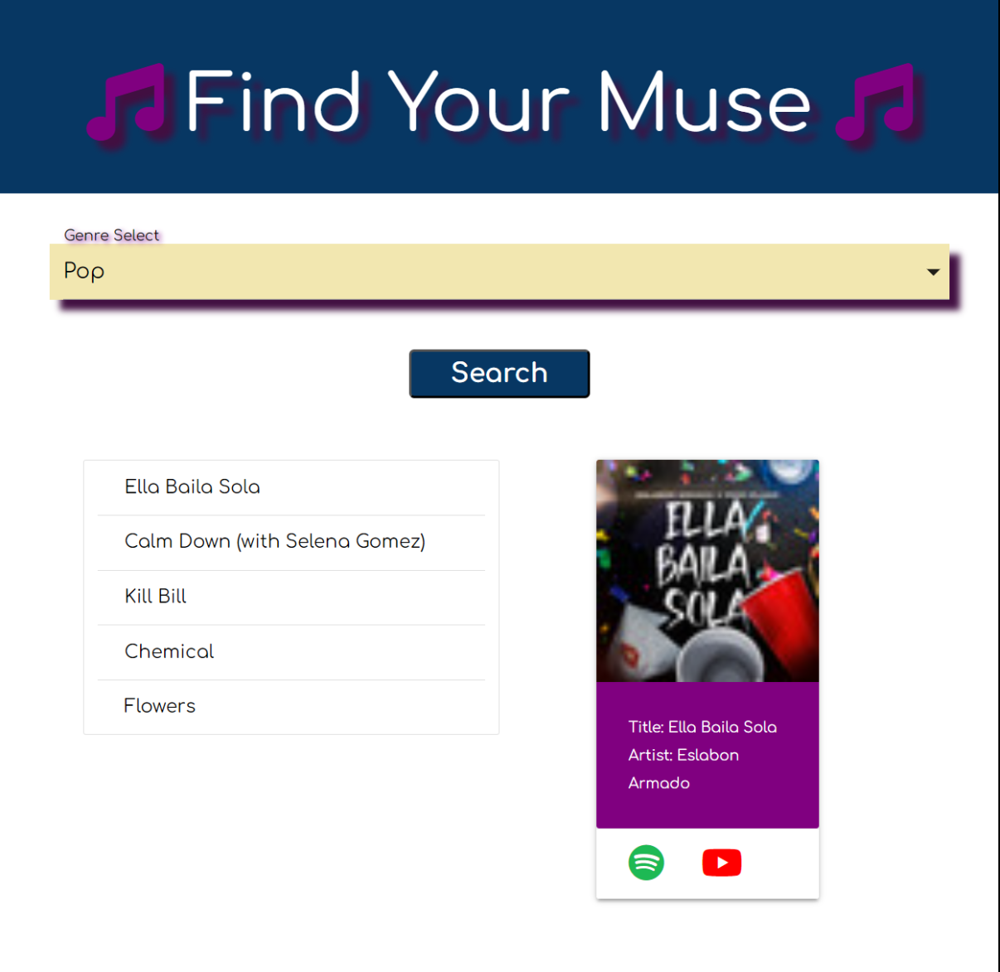

# Find Your Muse | Music Selection App
### **[Description](#description) | [Usage](#usage) | [Credits](#credits)**

## Description

- We wanted to spice up our music tastes and have someone else pick for once what we listen to.
- We build this website to solve that problem by choosing random songs based on a genre of music
- This solves the problem of choice
- When the songs populate they come out blurry to hide their identities so it's harder to reconize the songs before you click on them.
- We learned inegrating two API's with little to no knowledge is alot harder then thought. 

## Usage
Using this site is pretty straight forward at this time. You choose a genre of music and then the program will create a search to spotify where it will find some songs in that genre and will populate the titles for you. Click on a title that looks intresting and the album image will populate. Click on the spotify logo or youtube logo to listen to the song!

## Screenshots / Links

Deployed site
https://itsa-me-dea.github.io/FindYourMuse/ 

GitHub
https://github.com/itsa-me-dea/FindYourMuse 

**NOTE:** Due to limited YouTube API calls, the YouTube link is not available in the gif above, so the image below shows what it looks like when the API is available.

## Setup
N/A

## Project Status
Project is: _in progress_ 
This Project is not quite done. 

## Room for Improvement

Room for improvement:
- Create more options
- Unblur photos
- Cleaning up text / removing unneccessary code

To do:
- Add a Mood drop down option
- Make search randomized
- Create favorited song list section
- Create a local storage

## Credits
#### itsa-me-dea Github https://github.com/itsa-me-dea 
#### TristanM225 Github https://github.com/TristanM225 
#### ggulmom Github https://github.com/ggulmom

## Sources
- Abduraimov , Muminjon. “How to Extract Song Data from the Spotify Api?” Apilayer Blog - Everything about APIs, 8 Sept. 2022, blog.apilayer.com/how-to-extract-song-data-from-the-spotify-api/#:~:text=Spotify%20stores%20data%20on%20its,data%20using%20the%20Spotify%20API. 

- Youtube, Google. “Implementation: Search Requests&nbsp; |&nbsp; YouTube Data API&nbsp; |&nbsp; Google for Developers.” Google, developers.google.com/youtube/v3/guides/implementation/search. Accessed 18 May 2023. 